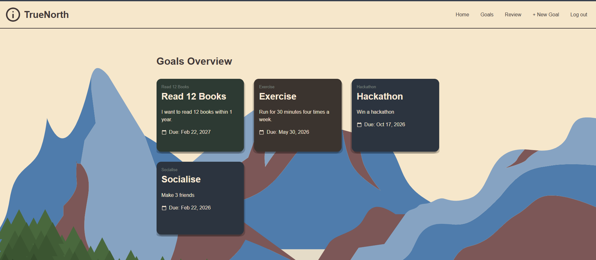

# True North

## Live Link & Description
www.truenorthapp.org 
True North is a goal tracking app, allowing users to create and view goals in a simple actionable manner. The user can review these goals to track progress and plan out the upcoming week.

I wanted to make this app so I could created goals in a nested nature. Sometimes goals can be quite far out, or involve many moving parts. This was an effort to be able to order goals, edit them, and break them down into steps for clarity moving forward.

The production server is hosted off my Raspberry Pi and served through Cloudflare, so if the link isn't live there are **photos below** of my website. 

## System Architecture

## Tech Stack
**Frontend** 
- React 
- Vite
**Backend**
- Python
- Django
- Sqlite3 (Testing / Local)
- PostgreSQL (Production)
**Deployment**
- Docker
- Cloudflare
## Key Features

- **Goal Management:** Create and edit top-level goals with support for nested **sub-goals** and actionable **steps**.
- **Recurring Steps:** "Step" system allowing for **recurring tasks** to automate routine progress tracking.
- **Progress Tracking:** "Tick" system to mark steps as complete and visualise goal momentum.
- **Performance Reviews:** Integrated review system to reflect on goal progress and plan upcoming cycles.
- **Demo Account**: A demo account to allow viewers & recruiters to try the website as a guest. 
### Auth

- **Session-Based Auth:** Secure login and sign-up flow using Django’s session framework.
- **Persistent Sessions:** Auto-login functionality using secure, cross-domain cookies.
- **CSRF Protection:** Hardened security layer for all state-changing requests (POST/PUT/DELETE).
### Future Goals

- **Goal Filtering:** Sort and filter goals by priority, status, or category.
- **User Profile Settings:** Profile management and settings to update details.
- **Enhanced UX:** Native Dark/Light mode toggle and mobile-responsive layout.
- **Refined Data Management:** Full CRUD support for deleting goals and editing historical reviews.
- **Support Dark Mode**
- **Add more testing for input validation**

## Local Setup (With Docker)

**Prerequisite**
* Make sure to have https://www.docker.com/products/docker-desktop/ installed & running
  
1. Clone the repository:
	In your command terminal move to the folder you want to place the repo. 
```
	[For Bash]
	git clone https://github.com/Callum-Harold/TrueNorth.git
	cd truenorth
```
2. Start the application locally:
```
docker compose up --build
```
Make sure the docker engine is running!
3. Access the website
	In your browser you can type http://localhost:3000


## Photos


